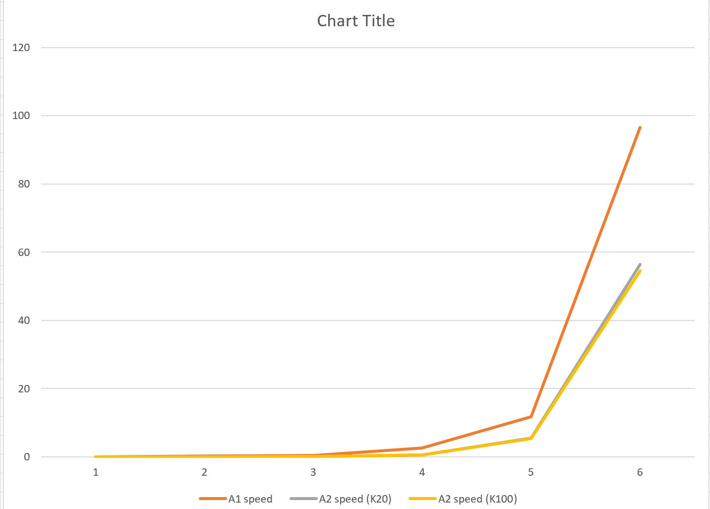
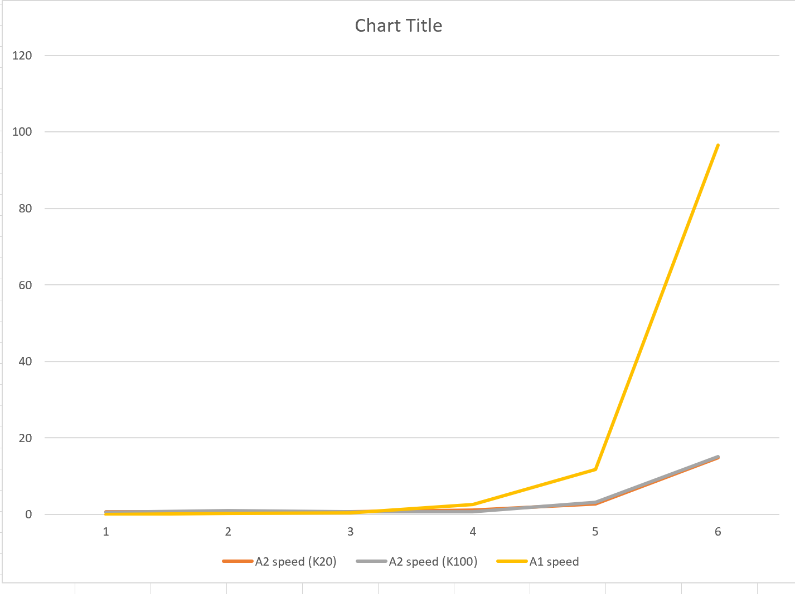
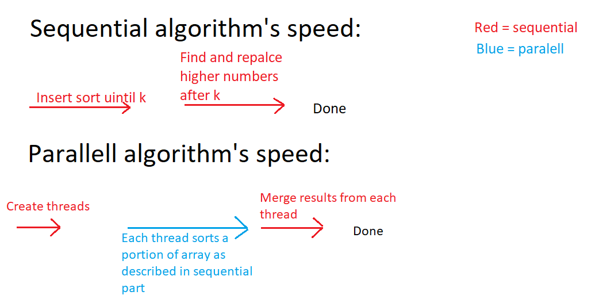

# IN4030-oblig-1 
### Tasks can be found in the resources folder

## Task 1
The tests in class 'Tests_Task1' demonstrates the different values as described in task 1. It also contains other unit tests to ensure the implementation is correct.

The method 'testSpeedComparison' the speed of each algorithm and prints out the results. The following table also shows when I ran the test :

- Results for array size 1000: Time usage for different algorithms: A1=0.0333, A2(K20) = 0.0163, A2(K100) = 0.0168
- Results for array size 10000: Time usage for different algorithms: A1=0.2911, A2(K20) = 0.1644, A2(K100) = 0.0249
- Results for array size 100000: Time usage for different algorithms: A1=0.4865, A2(K20) = 0.1731, A2(K100) = 0.1775
- Results for array size 1000000: Time usage for different algorithms: A1=2.5538, A2(K20) = 0.5286, A2(K100) = 0.538
- Results for array size 10000000: Time usage for different algorithms: A1=11.7892, A2(K20) = 5.5203, A2(K100) = 5.3735
- Results for array size 100000000: Time usage for different algorithms: A1=96.5663, A2(K20) = 56.3688, A2(K100) = 54.5405

(Times are in milliseconds)

|Array size |  A1 speed  | A2 speed (K20) | A2 speed (K100) |
|-----------|------------|----------------|-----------------|
|1000       |0.0333      |  0.0163        |0.0168           |
|10000      |0.2911      |  0.1644        |0.0249           |
|100000     |0.4865      |  0.1731        |0.1775           |
|1000000    |2.5538      |  0.5286        |0.538            |
|10000000   |11.7892     |  5.5203        |5.3735           |
|100000000  |96.5663     |  56.3688       | 54.5405         |

## Task 2

The tests in Tests_task2.cs demonstrates the async sorting method. The following table shows the timings when sorting asynchronously. (A1 is not included as there's no asynchronous option to sort this)

- Results for array size 1000: Time usage for different algorithms:  A2(K20) = 0.7923, A2(K100) = 0.6728
- Results for array size 10000: Time usage for different algorithms:  A2(K20) = 0.6977, A2(K100) = 0.9869
- Results for array size 100000: Time usage for different algorithms:  A2(K20) = 0.6948, A2(K100) = 0.7212
- Results for array size 1000000: Time usage for different algorithms:  A2(K20) = 1.2345, A2(K100) = 0.6814
- Results for array size 10000000: Time usage for different algorithms:  A2(K20) = 2.798, A2(K100) = 3.1326
- Results for array size 100000000: Time usage for different algorithms:  A2(K20) = 14.7829, A2(K100) = 15.0821

|Array size | A2 speed (K20) | A2 speed (K100) |
|-----------|---------------|-----------------|
|1000       | 0.7923        |0.6728           |
|10000      | 0.6977        |0.9869           |
|100000     | 0.6948        |0.7212           |
|1000000    | 1.2345        |0.6814           |
|10000000   | 2.798         |3.1326           |
|100000000  | 14.7829       | 15.0821         |

## Additional data
The tests have been running on my PC which has the CPU:
Processor	11th Gen Intel(R) Core(TM) i7-1165G7 @ 2.80GHz, 2803 Mhz, 4 Core(s), 8 Logical Processor(s)

### Calculation of speedup:
It's possible to calculate the speedup by dividing the sequential algorithm's execution time by the parallel algorithms' execution time. We can compare the table of task 1 with the table in task 2 and see the speedup differences:

|Array size | Parallel A2 speed (K20) | Sequential A2 speed (K20) | Speedup|
|-----------|---------------------------|---------------------------|--------|
|1000       | 0.7923                    |0.0163                     | 0.02   |
|10000      | 0.6977                    |0.1644                     | 0.23       |
|100000     | 0.6948                    |0.1731                     |  0.24      |
|1000000    | 1.2345                    |0.5286                     |  0.42      |
|10000000   | 2.798                     |5.5203                     |  1.92      |
|100000000  | 14.7829                   | 56.3688                   |   3.81     |

We can see that as the array size increases, we achieve a speedup which is > 1. It means that the paralell algorithm is more efficient to use as the array size increase.
The reason the algorithm is slower for a lower array size is because there's costs in this algorithm with forinstance starting new threads which can be expensive when we're anyway dealing with small arrays.

We also see that the execution time changes as the k value is changed. In the parallel algorithm it looks like the algorithm gets slower as the K increases. This is because we have larger arrays (a[0] to a[k - 1]) which has to be sorted and re-sorted.  We also see the similar tendencies in the sequential algorithm when changing the K number. There is however some times which we see that the K100 is faster than the K20. I belive this occurs due to other system events such as garbage collection, JIT compilation etc. In general looks like the K20 is faster than the K100 algorithm.

It's also interesting noting that the paralell algorithm does most of the sorting in paralell, however there's still a requirement before the sorting begins with starting up threads to sort which is sequential. There's also a sequential part after the sorting is finished where the main threads collects and merges the results which each thread has sorted. So even though we've increased the speed of the algorithm, we dont achieve 8 times faster sorting (as I have 8 cores) due to these factors 

#### Amdahl's law
We can see how Amdahl's law is applied to this program. We do parallelize parts of the code which means that a part of the code is done faster, however we're not achieving the speed of sequential runtime speed x threads as not all of the code can be parallelized
